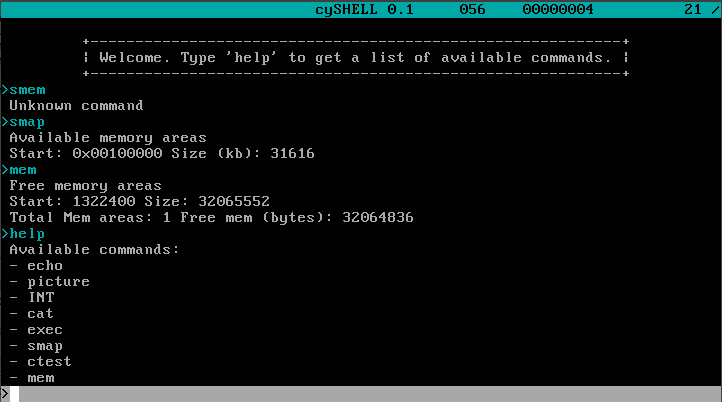

# cyOS
A small monolitic educational Java OS which was created as an exercise for the lecture "Betriebssysteme im Eigenbau" (Operating Systems self-made)

# Implemented Parts
- Virtual Memory (1:1 Mapped)
- Flexible Interrupt Handling
- Keyboard Driver
- VGA-Mode embedded Picture viewer
- Debug Screen for Exceptions
- Task Scheduler
- Cooperative Multitasking
- Kill blocking Tasks via keystroke
- Simple Shell (with buggy scrolling ;)
- Some test commands 
- Get memory map from BIOS
- Garbage collection (manually triggerable)
- Garbage collection statistics
- Virtio net 1.0 driver
- Ethernet / ARP / IPv4
- UDP (without checksum)
- DHCP Client & Server

And some more stuff. 

# In work
- DNS Client & Server (only ARecords)

# An OS in Java?
cyOS is compiled using the SJC Java to native compiler, which can be found here: http://www.fam-frenz.de/stefan/compiler.html

# DHCP

Server and Client implemented, should work with other standard compliant software. IPv4 and UDP only. 

## Server
Can be started with `dhcps start`. Assigns 192.168.100.x/24 addresses and the fixed DNS-Server 192.168.100.1
`dhcps stop` shuts down the dhcpserver.

## Client

`dhcp start <interface no>`

# DNS

Server and Client can read compressed DNS-Messages, but do not use 
 compression in outgoing messages.
 
 `dnss start`
 
 # Default test case
 
Two QEMU networks one "user" type network called "ext" and one "socket" type network called "cynet". 
One cyOs instance (called SERVER) with two network cards is connected to both of them. 
The other network card is - like the second cyOS instance (called CLIENT) - connected to the "cyos" network.

### On SERVER 
1. Run `dhcp start 1` to obtain an dhcp information from the ext nets dhcp server.
2. Run `net ip 0 192.168.5.1/24` to add a new ip to interface 0 (the one connected to cynet). 
Only /24 or bigger networks are correctly handled by the dhcpserver.
3. Start the dnsserver on the cynet interface 0 by executing `dnss start 0`
4. Execute `dhcps` to start the dhcp server on interface 0
5. Test linklocal, nameserver & recursive query `dig test.de`

## On CLIENT
1. Run `dhcp` to start the dhcp discovery on interface 0
2. `ifconfig`
3. Resolve local domain `dig first.cyos`
4. Resolve remote domain `dig google.de`
5. Try `net send first.cyos thisIsAMessageWithoutSpaces` to test DNS resolving from a "client" program.

The networks are configured to dump all traffic to .pcap files which can be 
read with Wireshark to observe the sent packages.